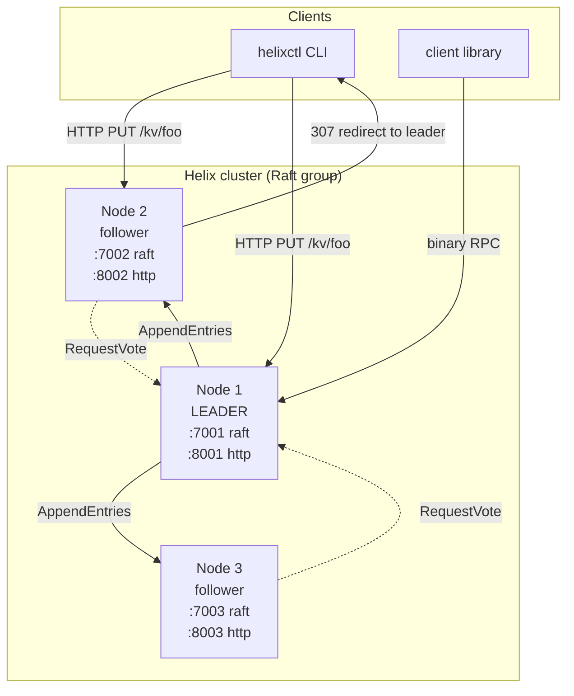
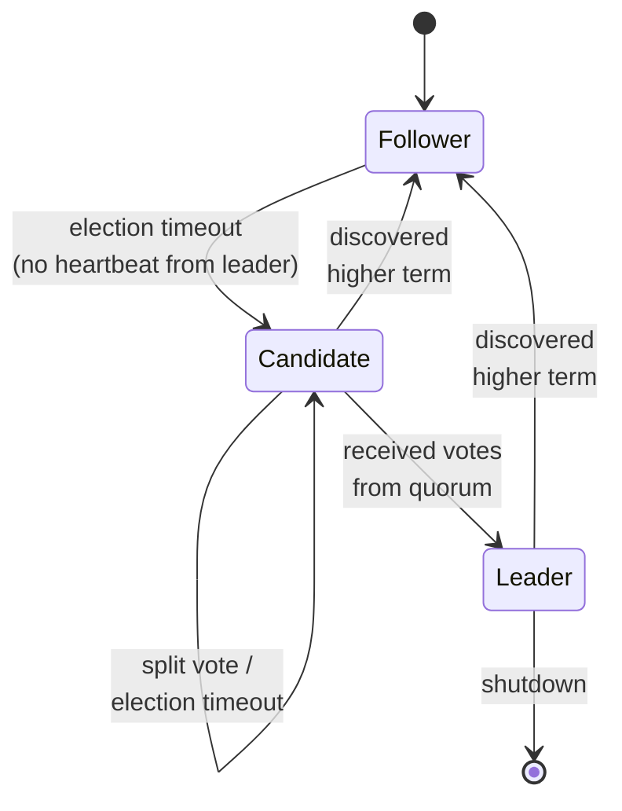
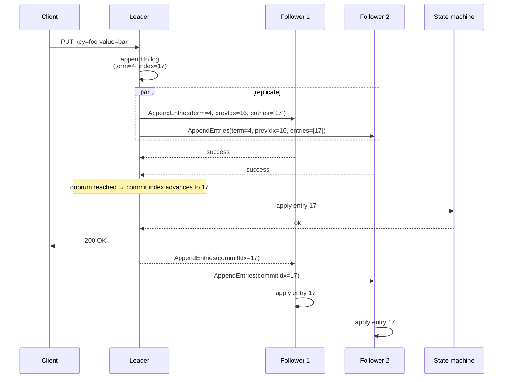

# Helix

> A distributed, fault-tolerant key-value store built from scratch in Go. Implements the Raft consensus protocol, a custom binary wire protocol over TCP, and supports cluster membership changes, log compaction via snapshots, and linearizable reads.

Helix is a from-scratch implementation of a Raft-replicated key-value store. It is not a wrapper around an existing Raft library — the consensus engine, the wire protocol, the log, the snapshot mechanism, and the leader-routing client are all implemented in this repository.

## Why this exists

Most "distributed KV store" tutorials stop at single-node `map[string]string` behind an HTTP handler. Helix goes further:

- A working **Raft** implementation: leader election, log replication, safety, log compaction, and persistence.
- A **custom binary wire protocol** for inter-node RPC, designed to be compact and parsed in a single pass.
- A **client library** that discovers the leader transparently and retries on `NotLeader` redirects.
- **Snapshots** so the log can be truncated and a new follower can catch up without replaying years of writes.
- A **3-node docker-compose cluster** for local testing of partition and failover scenarios.

## Cluster architecture



Writes always go through the leader. Followers respond to read or write requests with a redirect to the current leader (or a `NoLeader` error if an election is in progress). The leader appends to its log, replicates to a quorum, and only then applies to the state machine.

## Raft state machine



Each node holds one of three roles. Leadership is term-scoped. A node steps down the moment it sees a higher term, which is the safety property that prevents two leaders in the same term.

## Write path (replication)



The leader does not respond to the client until a quorum has durably accepted the entry. This is what gives Helix its linearizability guarantees on writes.

## Wire protocol

The inter-node RPC is a custom length-prefixed binary protocol. Every frame on the wire follows the same layout:

```
+--------+--------+--------------------+----------------+
|  type  | flags  |   payload length   |    payload     |
| 1 byte | 1 byte |      4 bytes (BE)  |  N bytes       |
+--------+--------+--------------------+----------------+
```

Message types:

| Type | Direction | Purpose |
|------|-----------|---------|
| `0x01` RequestVote | candidate → peer | ask for a vote in a new term |
| `0x02` RequestVoteResp | peer → candidate | grant or deny a vote |
| `0x03` AppendEntries | leader → follower | replicate log entries / heartbeat |
| `0x04` AppendEntriesResp | follower → leader | success/conflict response |
| `0x05` InstallSnapshot | leader → follower | bring a lagging follower up to date |
| `0x06` InstallSnapshotResp | follower → leader | acknowledge snapshot |

See [`docs/protocol.md`](docs/protocol.md) for the byte-level field layouts.

## Project layout

```
helix/
├── cmd/
│   ├── helixd/          # node daemon
│   └── helixctl/        # CLI client
├── internal/
│   ├── raft/            # consensus core: log, state, election, replication
│   ├── transport/       # custom binary protocol over TCP
│   ├── store/           # KV state machine + snapshots
│   ├── server/          # HTTP API
│   └── cluster/         # peer/membership config
├── pkg/client/          # public Go client library
├── docs/                # architecture and protocol notes
├── scripts/             # local cluster runner
├── docker-compose.yml   # 3-node demo cluster
└── Makefile
```

## Running a local 3-node cluster

```bash
make build
./scripts/run-cluster.sh
# in another shell:
./bin/helixctl put greeting "salam alaykum"
./bin/helixctl get greeting
./bin/helixctl status
```

Or with docker:

```bash
docker compose up --build
```

## Demonstrating fault tolerance

Kill the leader and watch a new one get elected:

```bash
docker compose kill helix-1
./bin/helixctl get greeting           # still works, served by new leader
docker compose start helix-1          # rejoins, catches up via log + snapshot
```

## What this codebase shows

- **Consensus correctness**: term monotonicity, election safety, log matching, leader completeness.
- **Network protocol design**: explicit framing, no reliance on JSON or gRPC code generation.
- **Operational realism**: graceful shutdown, persistent term/vote, snapshots so logs do not grow forever.
- **Client ergonomics**: transparent leader discovery, no manual cluster topology in user code.

## Roadmap

- Pre-vote phase to avoid disruptive elections during partitions
- Read-index optimization for linearizable reads without writing to the log
- Joint consensus for safe membership changes
- Pluggable storage backends (currently in-memory + WAL on disk)

## License

MIT
